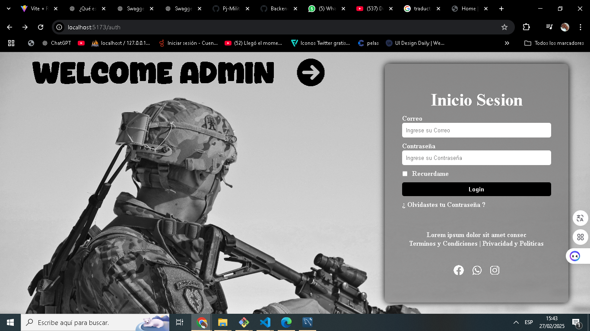

# PJ-MILITAR

## URI

para consumir los endpoint
http://localhost/Backend---Militar/public/#nombre-ruta

---

## Demo



---

## Swager

ejecutar este comando utilizando el server de Php

```bash
    php -S localhost:8000 -t swagger-ui/dist

```

- [http://localhost:8000](http://localhost:8000)

---
